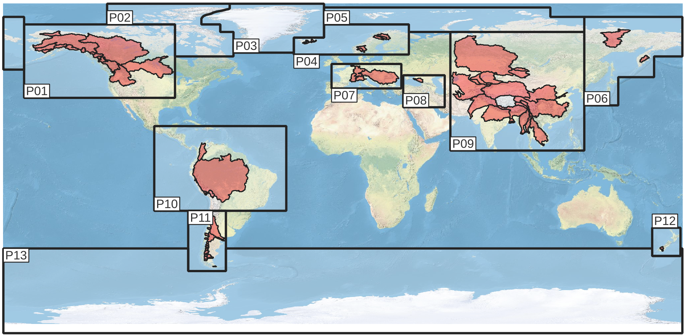

# Aggregation of OGGM data for the PROVIDE-dashboard

This repository outlines the workflow for aggregating OGGM data to support the PROVIDE-dashboard, accessible [here](https://climate-risk-dashboard.climateanalytics.org/). The process involves creating a grid based on target shapes like countries, runoff-basins, or glacier regions and then mapping OGGM model outputs onto this grid. You can find the raw model output for each PROVIDE region [here](https://cluster.klima.uni-bremen.de/~lschuster/provide/MESMER-M_projections/runs/output/oggm_v16/2023.3/2100/).

# Detailed aggregation workflow

## Tools used

The workflow utilizes Jupyter notebooks, Python scripts, and Bash scripts to run on either a local computer node or a cluster, depending on the task's computing needs. We avoid duplicating code by developing in notebooks and converting them into scripts using [Jupytext](https://jupytext.readthedocs.io/en/latest/index.html). Code cells specify their execution environment to ensure they run in the appropriate location (`if is_notebook:` for the node, `if not is_notebook:` for the cluster).

## General preprocessing

The initial tasks, detailed below, are performed once and support the aggregation process for all target shapes. Scripts are located in the `general preprocessing` folder.

### Identify commonly running glaciers

We filter out glaciers that successfully run in all Provide scenarios to maintain consistency in our analyses. This intensive process involves checking each glacier across all outputs, resulting in a selection of 206,685 glaciers, covering 568,736.7 km² (97.1% of all glaciers worldwide with 99.3% of the total area).

**output:** `general_data_for_aggregation/commonly_running_glaciers.json`
**notebook/script used:** `general_preprocessing/Get_common_running_glaciers.ipynb`
**executed on:** cluster

### Generate batch conversion list

To manage the extensive glacier data, results are stored in batches. A conversion list maps each glacier to its corresponding batch, optimizing data handling and reducing memory usage during aggregation.

**output:** `general_data_for_aggregation/rgi_ids_to_result_batch.json`
**notebook/script used:** `general_preprocessing/Create_batch_conversion_list.ipynb`
**executed on:** computer node

### Assign reference points to glaciers

Each glacier is attributed to a target shape using a defined spatial point, either the glacier terminus or its centroid if the terminus is unavailable.

**output:** `general_data_for_aggregation/rgi_position_terminus_backdrop_centroid.csv`
**notebook/script used:** `general_preprocessing/Create_rgi_terminus_backdrop_centroid.ipynb`
**executed on:** computer node

## Example target shape aggregation

The following steps outline the aggregation process for a sample target shape, using placeholder `target_shape` for specific scripts. For each target a dedicated folder is defined (e.g. `countries`), which contains the actuals shapes in the folder `data`.

### Map glaciers to target shapes

This step creates a mapping of glaciers to each target shape, using only the commonly running glaciers defined previously.

**output:** `target_shape/data/dict_target_shape_to_rgi_ids.json`
**notebook/script used:** `target_shape/general_preprocessing_target_shape.ipynb`
**executed on:** computer node

### Prepare gridded output structure

We define a grid resolution for the output data and extract grid points that intersect with the target geometry. These points form the basis of the gridded output structure, defined as as xarray-Dataset with the structure:

  - coordinates: `(lat, lon)`
  - datavariable: `rgi_ids`, which contains a list of the glaciers per grid point or `None` if no glacier is located in a particular grid point
  - attributes: `resolution`, `grid_points_with_data` and `result_batches`, the later describing the exact batched files which need to be opened

For visual inspections, a plot of the resulting gridded structure is saved under `target_shape/resolution_folder/grid_plots`.

**output:** `target_shape/resolution_folder/preprocessed_target_shape_grids.json`
**notebook/script used:** `target_shape/resolution_folder/preprocessing_workflow_X_deg.ipynb`
**executed on:** cluster

### Perform actual data aggregation

The actual aggregation of the data is split into two steps:

#### Open each scenario, gcm and quantile

For each scenario, GCM, and quantile, data is opened, aggregated onto the grid, and saved. Integrated values for total shape are also calculated and saved.

**output:** `target_shape/resolution_folder/aggregated_data_intermediate/target/map_data/target_scenario_gcm_quantile_map_data.nc` and `target_shape/resolution_folder/aggregated_data_intermediate/target/total_data/target_scenario_gcm_quantile_total_data.nc`
**notebook/script used:** `target_shape/resolution_folder/aggregation_workflow_X_deg_open_files.ipynb`
**executed on:** cluster

#### Merge gcm and quantiles for a single scenario

This step aggregates data from each scenario's GCMs and quantiles. Unlike direct GCM-quantile combinations, which only show variation among GCM outputs, we integrate these into a glacier-specific output distribution. This is achieved by repeating each GCM-quantile result in the final distribution according to its proportion in the total data: (0.05: 6 repetitions), (0.25: 9 repetitions), (0.50: 10 repetitions), (0.75: 9 repetitions), and (0.95: 6 repetitions). We then draw glacier quantiles for the mapped and total data from this adjusted distribution. Additionally, we calculate an unavoidable risk by defining a threshold (e.g., 30% of glacier volume melted by 2100) and assessing the proportion of realisations in one scenario exceeding this threshold. This provides a probability value between 0 (no realisation exceeds the threshold) and 1 (all realisations exceed the threshold).

**output:** `target_shape/resolution_folder/aggregated_data/target/scenario_map.nc`, `target_shape/resolution_folder/aggregated_data/target/scenario_timeseries.nc` and `target_shape/resolution_folder/aggregated_data/target/scenario_unavoidable_risk.nc`
**notebook/script used:** `target_shape/resolution_folder/aggregation_workflow_X_deg_scenario.ipynb`
**executed on:** cluster

### Testing and checking final aggregated data

The final datasets are tested for completeness and consistency in a desiganted notebook. Moreover, visualizations are created for each dataset to facilitate preliminary analysis.

**output:** `target_shape/resolution_folder/aggregated_result_plots/target/target_scenario_variable_unavoidable_risk.png`, `target_shape/resolution_folder/aggregated_result_plots/target/target_scenario_map.png` and `target_shape/resolution_folder/aggregated_result_plots/target/target_scenario_timeseries.png`
**notebook/script used:** `target_shape/resolution_folder/check_aggregation_results.ipynb`
**executed on:** cluster